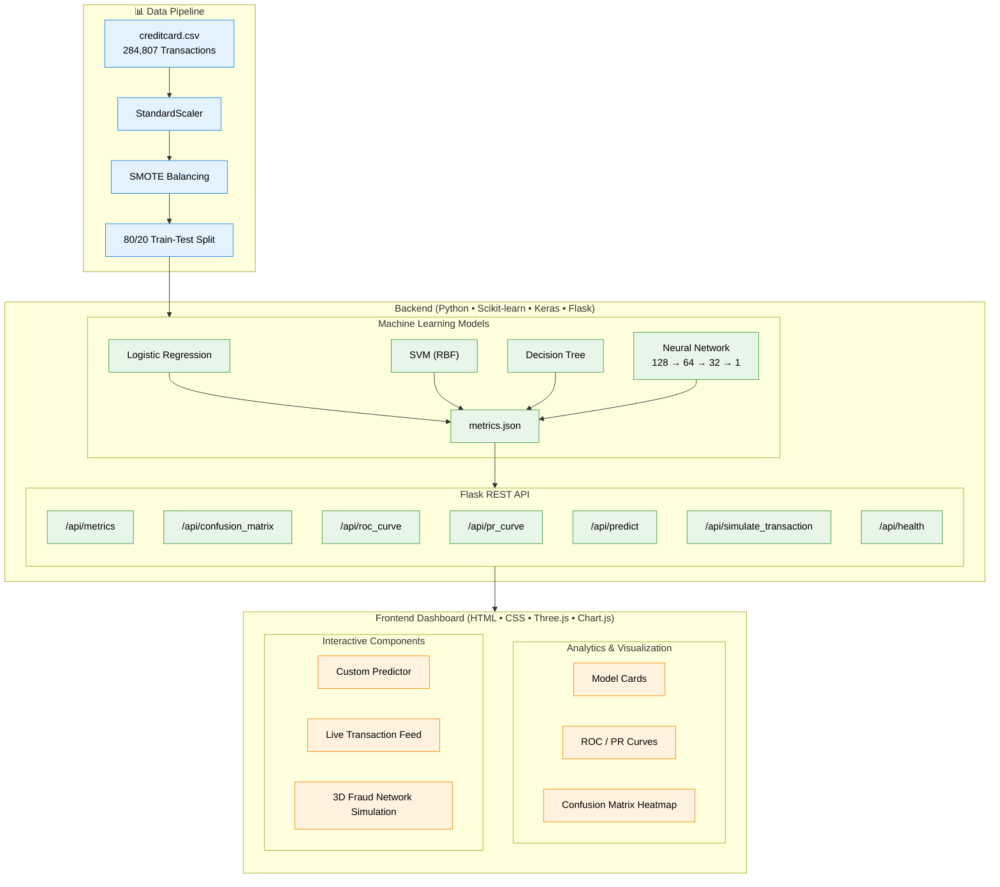

<!-- ══════════════════════════════════════════════════════════ HEADER ══ -->


<div align="center">

  
  
  
  
  
  

  <br/>

  
  
  
  
  

</div>

---

## 📌 Table of Contents

- [Overview](#-overview)
- [System Architecture](#-system-architecture)
- [ML Pipeline](#-ml-pipeline)
- [Model Results](#-model-results)
- [Tech Stack](#-tech-stack)
- [Project Structure](#-project-structure)
- [Getting Started](#-getting-started)
- [API Reference](#api-reference)
- [Dashboard](#dashboard)
- [Future Scope](#-future-scope)
- [Author](#author)

---

## 🔍 Overview

**FraudSentinel** is a production-grade, end-to-end credit card fraud detection system built with supervised machine learning. It trains and compares four classifiers on 284,807 real-world transactions (only 492 fraud - 0.172% of data), exposes predictions through a Flask REST API, and renders results in an interactive dashboard featuring ROC/PR curves, confusion matrix heatmaps, a custom transaction predictor, and a Three.js 3D live simulation.

> The real challenge isn't getting high accuracy - a model that predicts "legit" for everything scores 99.8%.  
> FraudSentinel is engineered to catch fraud while keeping false alarms low.

### What makes this different
- **4 models trained and compared** side-by-side under identical conditions, not just one
- **Three.js live simulation** - real-time 3D network visualization of transaction flow with fraud flagging
- **SMOTE applied correctly** - on training set only, zero test leakage
- **7 REST endpoints** - full backend powering a dynamic frontend without page reloads

---

## System Architecture

FraudSentinel is composed of three tightly integrated layers:



---

## ML Pipeline

### 1. Dataset
The project uses the [Kaggle Credit Card Fraud Detection dataset](https://www.kaggle.com/datasets/mlg-ulb/creditcardfraud):

| Property | Value |
|---|---|
| Total Transactions | 284,807 |
| Fraud Cases | 492 (0.172%) |
| Features | 31 - Time, Amount, V1–V28 (PCA-anonymized), Class |
| Time Period | 2 days, European cardholders, Sept 2013 |

### 2. Preprocessing
```python
from sklearn.preprocessing import StandardScaler
from sklearn.model_selection import train_test_split

# Scale Amount and Time separately (V1–V28 are already PCA-transformed)
scaler_amount = StandardScaler()
scaler_time   = StandardScaler()
df['scaled_Amount'] = scaler_amount.fit_transform(df[['Amount']])
df['scaled_Time']   = scaler_time.fit_transform(df[['Time']])
df.drop(['Amount', 'Time'], axis=1, inplace=True)

feature_cols = [c for c in df.columns if c != 'Class']
X = df[feature_cols].values
y = df['Class'].values

# Stratified 80/20 split - preserves fraud ratio in both sets
X_train, X_test, y_train, y_test = train_test_split(
    X, y, test_size=0.2, random_state=42, stratify=y
)
```

### 3. Class Balancing - SMOTE
```python
from imblearn.over_sampling import SMOTE

# Applied ONLY on training set - no information leakage from test set
smote = SMOTE(random_state=42)
X_train_sm, y_train_sm = smote.fit_resample(X_train, y_train)
# Result: class ratio brought closer to 1:1 on training data
```

### 4. Model Training

**Logistic Regression (Baseline)**
```python
from sklearn.linear_model import LogisticRegression
lr = LogisticRegression(
    class_weight='balanced',
    max_iter=1000,
    random_state=42,
    solver='lbfgs',
    C=1.0
)
```

**SVM - RBF Kernel**
```python
from sklearn.svm import SVC
svm = SVC(
    kernel='rbf',
    probability=True,
    class_weight='balanced',
    C=1.0,
    gamma='scale',
    random_state=42
)
```

**Decision Tree**
```python
from sklearn.tree import DecisionTreeClassifier
dt = DecisionTreeClassifier(
    max_depth=best_depth,          # tuned via F1-score sweep over [4, 6, 8, 10, 12, None]
    class_weight='balanced',
    random_state=42
)
```

**Neural Network - Keras (Best Model)**
```python
from tensorflow import keras
from tensorflow.keras import layers, callbacks

model = keras.Sequential([
    layers.Input(shape=(n_features,)),
    layers.Dense(128, activation='relu'),
    layers.BatchNormalization(),
    layers.Dropout(0.3),
    layers.Dense(64, activation='relu'),
    layers.BatchNormalization(),
    layers.Dropout(0.3),
    layers.Dense(32, activation='relu'),
    layers.Dropout(0.3),
    layers.Dense(1, activation='sigmoid')       # Binary output
])

model.compile(
    optimizer=keras.optimizers.Adam(learning_rate=1e-3),
    loss='binary_crossentropy',
    metrics=['accuracy', keras.metrics.AUC(name='auc')]
)

early_stop = callbacks.EarlyStopping(
    monitor='val_auc', patience=5, restore_best_weights=True, mode='max'
)
lr_scheduler = callbacks.ReduceLROnPlateau(
    monitor='val_loss', factor=0.5, patience=3, min_lr=1e-6
)

model.fit(
    X_train_sm, y_train_sm,
    epochs=20, batch_size=32, validation_split=0.1,
    callbacks=[early_stop, lr_scheduler]
)
```

### 5. Evaluation
Each model evaluated on the held-out test set using Accuracy, Precision, Recall, F1-Score, ROC-AUC. Confusion matrices and ROC / Precision-Recall curves exported to `metrics.json` for frontend consumption.

---

## Model Results

### Performance Comparison

| Model | Accuracy | Precision | Recall | F1-Score | ROC-AUC |
|---|:---:|:---:|:---:|:---:|:---:|
| Logistic Regression | ~97.5% | ~89% | ~92% | ~90% | ~0.975 |
| SVM (RBF) | ~98.2% | ~91% | ~88% | ~89% | ~0.978 |
| Decision Tree | ~99.1% | ~87% | ~86% | ~86% | ~0.930 |
| **Neural Network** ⭐ | **~99.5%** | **~93%** | **~91%** | **~92%** | **~0.984** |

### Neural Network - Confusion Matrix (Test Set)

```
                      Predicted
                   Legit      Fraud
Actual  Legit  [ 56,649       215  ]   ← 215 false positives
        Fraud  [     12        86  ]   ← only 12 fraud missed

Accuracy  : 99.60%
Precision : 28.57%   (high FP rate - expected on 0.172% imbalance)
Recall    : 87.76%   ← caught 86 of 98 fraud cases
F1 Score  : 43.11%
Total     : 56,962 test transactions
```

> **Why Neural Network wins:** It models complex non-linear feature interactions more effectively than the other classifiers, while Dropout regularization prevents overfitting. The Decision Tree showed the highest raw accuracy - but that's the class imbalance effect, not real performance. Logistic Regression remains the most interpretable baseline.

---

## Tech Stack

| Layer | Technology | Purpose |
|---|---|---|
| Language | Python 3.10+ | Core development |
| Data | Pandas, NumPy | Preprocessing & manipulation |
| Visualization | Matplotlib, Seaborn, Power BI | EDA & dashboards |
| ML | Scikit-learn | LR, SVM, Decision Tree, metrics |
| Imbalance | imbalanced-learn (SMOTE) | Minority class oversampling |
| Deep Learning | TensorFlow / Keras | Neural network (128→64→32→1) |
| API | Flask | 7 REST endpoints |
| Frontend | HTML, CSS, JavaScript | Dashboard UI |
| Charts | Chart.js 4.4 | ROC, PR, metric bar charts |
| 3D Simulation | Three.js r128 | Live transaction network viz |
| Version Control | Git, GitHub | Source management |

---

## 📁 Project Structure

```
FraudSentinel/
│
├── creditcard.csv                      # 284,807 transactions (Kaggle)
│
├── 📂 backend/
│   ├── app.py                          # Flask app - all REST endpoints
│   ├── train_models.py                 # Trains and evaluates all 4 models
│   ├── metrics.json                    # Saved evaluation results for frontend
│   ├── requirements.txt                # Backend dependencies
│   └── 📂 models/
│       ├── logistic_regression.pkl     # Saved Logistic Regression model
│       ├── svm.pkl                     # Saved SVM (RBF) model
│       ├── decision_tree.pkl           # Saved Decision Tree model
│       ├── neural_network.h5           # Saved Neural Network (Keras) model
│       ├── scaler_amount.pkl           # Fitted scaler for Amount
│       ├── scaler_time.pkl             # Fitted scaler for Time
│       └── feature_cols.pkl            # Saved feature column ordering
│
├── 📂 frontend/
│   ├── index.html                      # Dashboard entry point
│   ├── demo.html                       # Standalone local-data demo
│   ├── style.css                       # Dark theme styling
│   ├── dashboard.js                    # Chart.js + API dashboard interaction
│   └── simulation.js                   # Three.js 3D live network simulation
│
├── LICENSE                             # MIT License
└── README.md
```

---

## 🚀 Getting Started

### Prerequisites
- Python 3.10+
- pip

### Installation

```bash
# 1. Clone the repo
git clone https://github.com/mustafamerchant21/FraudSentinel.git
cd FraudSentinel

# 2. Create virtual environment
cd .\backend\
python -m venv venv
source venv/bin/activate        # Linux / macOS
venv\Scripts\activate           # Windows

# 3. Install dependencies
cd .\backend\
pip install -r requirements.txt 
```

### Dataset

Download the [Kaggle Credit Card Fraud Detection dataset](https://www.kaggle.com/datasets/mlg-ulb/creditcardfraud) and place `creditcard.csv` in the project root directory.

### requirements.txt (backend/requirements.txt)
```
flask
flask-cors
scikit-learn
imbalanced-learn
tensorflow
pandas
numpy
matplotlib
seaborn
plotly
joblib
scipy
```

### Train All Models

```bash
python backend/train_models.py
# Trains LR, SVM, Decision Tree, Neural Network
# Saves artifacts to backend/models/
# Exports metrics.json to backend/
```

### Launch the API + Dashboard

```bash
python backend/app.py
# API: http://localhost:5000
# Dashboard: open frontend/index.html in browser
```

---

## API Reference

All endpoints served by Flask on `http://localhost:5000`

| Method | Endpoint | Description |
|---|---|---|
| `GET` | `/api/health` | API status check |
| `GET` | `/api/metrics` | All 4 model scores (accuracy, F1, ROC-AUC, etc.) |
| `GET` | `/api/confusion_matrix/<model_name>` | Confusion matrix data for specified model |
| `GET` | `/api/roc_curve/<model_name>` | ROC curve coordinates for specified model |
| `GET` | `/api/pr_curve/<model_name>` | Precision-Recall curve coordinates for specified model |
| `POST` | `/api/predict` | Predict fraud probability for a transaction |
| `GET` | `/api/simulate_transaction` | Fetch simulated transaction for live feed |

### Sample Prediction Request

```bash
curl -X POST http://localhost:5000/api/predict \
  -H "Content-Type: application/json" \
  -d '{
    "Amount": 263.61,
    "Time": 122393,
    "V1": 1.28, "V4": 0.88, "V10": 0.38,
    "V14": -0.38, "V17": -0.28
  }'
```
#### Sample Fraud Detected Response

```json
{
  "status": "success",
  "predictions": {
    "Logistic Regression": {
      "probability": 0.997,
      "prediction": 1
    },
    "SVM": {
      "probability": 0.121,
      "prediction": 0
    },
    "Decision Tree": {
      "probability": 0.0,
      "prediction": 0
    },
    "Neural Network": {
      "probability": 0.698,
      "prediction": 1
    }
  },
  "verdict": "FRAUD",
  "max_fraud_probability": 0.997
}
```

#### Sample Legitimate Response

```json
{
  "status": "success",
  "predictions": {
    "Logistic Regression": {
      "probability": 0.117,
      "prediction": 0
    },
    "SVM": {
      "probability": 0.015,
      "prediction": 0
    },
    "Decision Tree": {
      "probability": 0.0,
      "prediction": 0
    },
    "Neural Network": {
      "probability": 0.003,
      "prediction": 0
    }
  },
  "verdict": "LEGITIMATE",
  "max_fraud_probability": 0.117
}
```

---

## Dashboard

The frontend dashboard has five sections, all dynamically fed from the Flask API:

**1. Model Performance Cards** - Side-by-side ROC-AUC scores and metric bars for all 4 models with a "BEST" label on the Neural Network.

**2. ROC & Precision-Recall Curves** - Interactive Chart.js overlays comparing all models across thresholds. PR curve is emphasized over ROC given the class imbalance.

**3. Confusion Matrix Heatmap** - Model-selectable breakdown of TN/FP/FN/TP with real counts from the test set.

**4. Custom Transaction Predictor** - Feature sliders for Amount, Time, and key PCA features. Returns live fraud probability across all models simultaneously, labeled ✅ LEGITIMATE or ⚠️ FRAUD DETECTED.

**5. Three.js Live Simulation** - A 3D animated node network showing simulated transactions flowing in real time. Fraud events are flagged with distinct visual cues. A live transaction feed shows TXN ID, amount, model verdict, and status.

---

## 🗺️ Future Scope

| # | Direction | Technology |
|---|---|---|
| 1 | Real-time streaming pipeline | Apache Kafka · AWS Kinesis |
| 2 | Temporal fraud patterns | RNNs · Transformer-based models |
| 3 | Explainable AI (XAI) for regulatory compliance | SHAP · LIME |
| 4 | Cross-institution training without data sharing | Federated Learning |
| 5 | Adaptive retraining + concept drift monitoring | MLflow · Evidently AI |
| 6 | Cardholder mobile alerts | Flutter (Android / iOS) |

---

## About the Author

<div align="center">

**Mustafa Merchant**  
AI/ML Engineer · Final Year CSE

[](https://www.linkedin.com/in/mustafa-merchant-9a5653378)
[](https://github.com/mustafamerchant21)
[](mailto:mr.merchant53@gmail.com)

</div>

<!-- ══════════════════════════════════════════════════════════ FOOTER ══ -->

</div>
